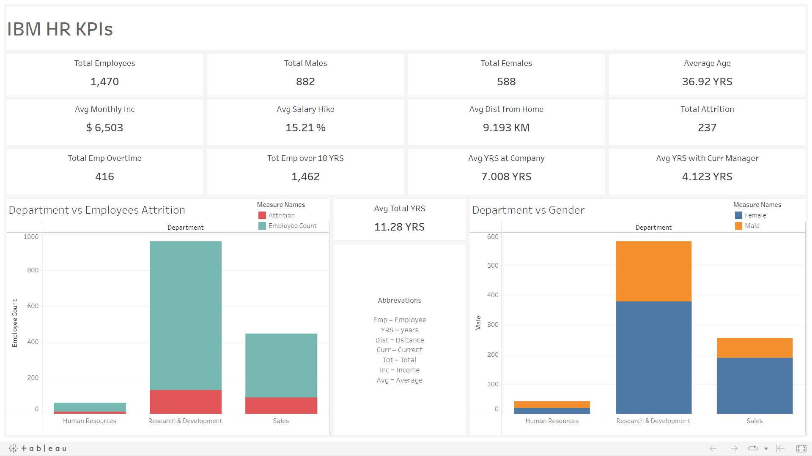

# IBM HR Analysis

Employee Analysis for HR Department of IBM Company

## Tech Stack


## Download

```bash
  git clone https://github.com/adionmission/IBM-HR-Analysis.git
```

## About

The original procedures uses python and jupyter for analysis which never explained the logic for there analysis and the jupyter notebook never provieded any dashboard for clean analysis.

As the dataset is not that big, so for data insights, EXCEL was used instead of SQL. But cleaning data in the excel is not reliable at all and even more time consuming than SQL.

Too much of manual work you know.

Now here comes the role on R where you just need to define a function in a pipline.

## Data Pipeline in R

```r
  data_clean = df %>%
    drop_na()
```

## About Dataset

The dataset is made by IBM scientists as per the acknowledgement. It gives the detailed information about the employess to the HR Department. The below information is from the original dataset. The int values were replaced with its char values by the acknowledgement.

| Name             | Description                                                                |
| ----------------- | ------------------------------------------------------------------ |
| AGE | Numerical Value |
| ATTRITION | Employee leaving the company (0=no, 1=yes) |
| BUSINESS TRAVEL | (1=No Travel, 2=Travel Frequently, 3=Tavel Rarely) |
| DAILY RATE | Numerical Value - Salary Level |
| DEPARTMENT | (1=HR, 2=R&D, 3=Sales) |
| DISTANCE FROM HOME| Numerical Value |
| EDUCATION | (1=Bellow College, 2=College, 3=Bachelor, 4=Master, 5=Doctor)  |
| EDUCATION FIELD | (1=HR, 2=LIFE SCIENCES, 3=MARKETING, 4=MEDICAL SCIENCES, 5=OTHERS, 6= TEHCNICAL) |
| EMPLOYEE COUNT | Numerical Value |
| EMPLOYEE NUMBER | Numerical Value - EMPLOYEE ID |
| ENVIROMENT SATISFACTION | Numerical Value |
| GENDER | (1=FEMALE, 2=MALE) |
| HOURLY RATE | Numerical Value |
| JOB INVOLVEMENT | (1=Low, 2=Medium, 3=High, 4=Very High) |
| JOB LEVEL | Numerical Value |
| JOB ROLE | (1=HC REP, 2=HR, 3=LAB TECHNICIAN, 4=MANAGER, 5= MANAGING DIRECTOR, 6=REASEARCH DIRECTOR, 7=RESEARCH SCIENTIST, 8=SALES EXECUTIEVE, 9=SALES REPRESENTATIVE) |
| JOB SATISFACTION | (1=Low, 2=Medium, 3=High, 4=Very High) |
| MARITAL STATUS | (1=DIVORCED, 2=MARRIED, 3=SINGLE) |
| MONTHLY INCOME | Numerical Value |
| MONTHY RATE | Numerical Value |
| NUMCOMPANIES WORKED | Numerical Value |
| OVER 18 | (1=YES, 2=NO) |
| OVERTIME | (1=NO, 2=YES) |
| PERCENT SALARY HIKE | Numerical Value |
| PERFORMANCE RATING | (1=Low, 2=Good, 3=Excellent, 4=Outstanding) |
| RELATIONS SATISFACTION | (1=Low, 2=Medium, 3=High, 4=Very High) |
| STANDARD HOURS | Numerical Value |
| STOCK OPTIONS LEVEL | Numerical Value |
| TOTAL WORKING YEARS | Numerical Value |
| TRAINING TIMES LAST YEAR | Numerical Value |
| WORK LIFE BALANCE | (1=bad, 2=good, 3=better, 4=best) |
| YEARS AT COMPANY | Numerical Value |
| YEARS IN CURRENT ROLE | Numerical Value |
| YEARS SINCE LAST PROMOTION | Numerical Value |
| YEARS WITH CURRENT MANAGER | Numerical Value |

## Original Methodology
 - Data insights using Python.
 - Data cleaning using Python.
 - Data visualization using Python.

## My Methodology
 - Data insights using Excel.
 - Data cleaning using R programming.
 - Data visualization using Tableau.

## Data Cleaning

In the dataset, the coversion of paraemters - Education, EnvironmentSatisfaction, JobInvolvement, JobSatisfaction, PerformanceRating, RelationshipSatisfaction and WorkLifeBalance from int to char where performed.

For Education

```r
  dataclean$education[dataclean$education == 5] = "Doctor"
```

For EnvironmentSatisfaction

```r
  dataclean$environment_satisfaction[dataclean$environment_satisfaction == 4] = "Very High"
```

For JobInvolvement

```r
  dataclean$job_involvement[dataclean$job_involvement == 4] = "Very High"
```

For JobSatisfaction

```r
  dataclean$job_satisfaction[dataclean$job_satisfaction == 4] = "Very High"
```

For PerformanceRating

```r
  dataclean$performance_rating[dataclean$performance_rating == 4] = "Outstanding"
```

For RelationshipSatisfaction

```r
  dataclean$work_life_balance[dataclean$work_life_balance == 4] = "Best"
```

For WorkLifeBalance

```r
  dataclean$relationship_satisfaction[dataclean$relationship_satisfaction == 4] = "Very High"
```

Further, for employees age and over18 columns, the over18 column has Y (Yes) as input for those who are 18 yrs of age. Then converted Y to 1 and N to 0 for count.

```r
  dataclean$over18[dataclean$age == 18] = "N"
  dataclean$over18[dataclean$over18 == "Y"] = 1
```

Converted overtime and attrition from (Yes, No) to (1, 0). 

```r
  dataclean$over_time[dataclean$over_time == "Yes"] = 1
  dataclean$attrition[dataclean$attrition == "Yes"] = 1
```

Removing unnecessary columns and cleaning at the end if some NAs left.

```r
  subset(dataclean, select = -c(daily_rate, 
                                hourly_rate, 
                                monthly_rate, 
                                standard_hours, 
                                stock_option_level, 
                                training_times_last_year, 
                                years_since_last_promotion))
  na.omit(dataclean)
```

## New Parameters

Created 3 new parameter that are:

 - Male
 - Female
 - Attrition_str

Wanted to count total number of males and females, so created separated column for it as it makes logic.

```r
  dataclean$male = c(dataclean$gender)
  dataclean$male[dataclean$male == "Male"] = 1
  dataclean$female = c(dataclean$gender)
  dataclean$female[dataclean$female == "Male"] = 0
```

Also, Wanted to show attrition in graph but numbers dosen't look good in x-axis. So created new column for attrition as attrition_str.

```r
  dataclean$attrition_str = c(dataclean$attrition)
  dataclean$attrition_str[dataclean$attrition_str == 1] = "Yes"
```

## Visualizations

The visualization were made using Tableau.



## Acknowledgements

 - [Dataset](https://www.kaggle.com/datasets/pavansubhasht/ibm-hr-analytics-attrition-dataset)
